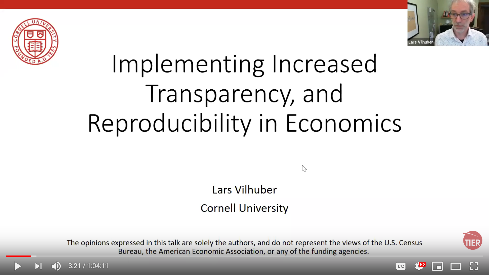

# Pre-training tasks {#pre-training}

We ask that trainees accomplish a few tasks prior to the first training session. Please do the following:

## Read

- The training is virtual, using video, and we frequently meet virtually. Review our [Video Etiquette rules](https://github.com/labordynamicsinstitute/replicability-training/wiki/Videoconferencing-Rules-and-Etiquette) (they are useful beyond our group as well)
- Review our [Privacy Policy](#privacy), where you will recognize how we handle your privacy, and the privacy of authors. 

## View

- View [my talk on the background of the lab](https://www.youtube.com/watch?v=rLoeNzOApFk), including what we do, and why we do it. 

## Install

- Go through our [Setup Checklist](setup-checklist.md) and install necessary software

### Try-out

- Try out command line, Markdown, Git (we'll come back to it on the first day).